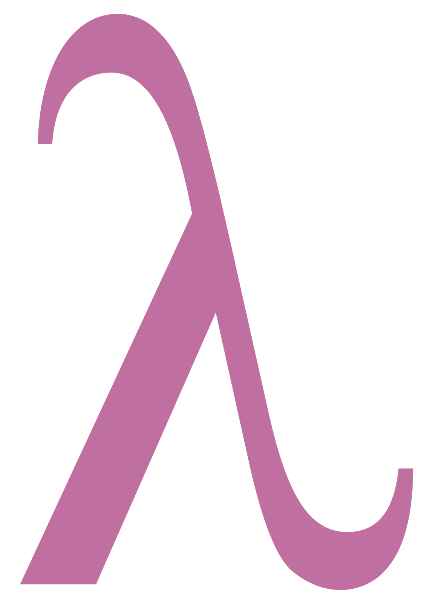
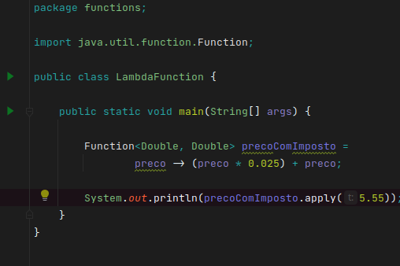

# Lambdas em Java



---

A programação funcional é um paradigma de programação baseado em um modelo 
de computação criado pelo matemático Alonzo Church, denominado `Cálculo Lambda`.
Nesse paradigma existem basicamente funcões puras, que podem utilizar a 
composição para criar funcões mais complexas.

As expressões lambdas foram inicialmente incluidas no Java 8 (2014).
Essas expressões podem ser implementadas através de métodos abstratos únicos 
com a annotation `@FunctionalInterface`. Um exemplo bastante conhecido é a 
interface Runnable:

```java
@FunctionalInterface
public interface Runnable {
    public abstract void run();
}
```

As expressões lambda são fornececidas pelo pacote [java.util.function]("https://docs.oracle.com/javase/8/docs/api/java/util/function/package-summary.html")

---

## Function

As Functions recebem apenas um parâmetro, realizam a operação e geram o output.
O tipo de entrada não precisa ser o mesmo da saída.
É permitido fazer composição da Function com outras interfaces funcionais.

Exemplo de estrutura

```java
Function<TipoEntrada, TipoSaida> nomeDaFunction = parametro -> operação;

```

Exemplo de implementação de uma Function:



Para realização operações com a Function  basta utilizar o `.apply(parâmetro)
`, e 
assim 
como outras interfaces funcionais, é possível fazer composição, utilizar o 
.AndThen e outros recursos.

---

## Interfaces Funcionais

---

## Predicate

---

## Consumer

---

## Supplier

---

## Unary Operator

---

## Binary Operator

---

## BiFunction

---

### Referências
