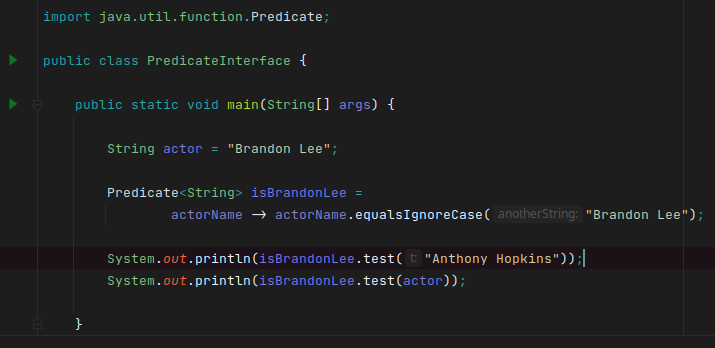
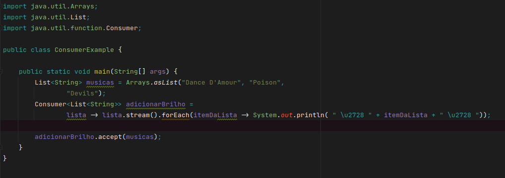
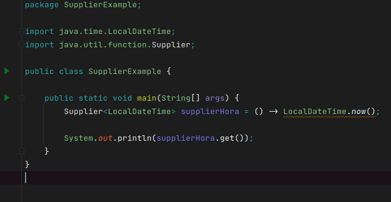
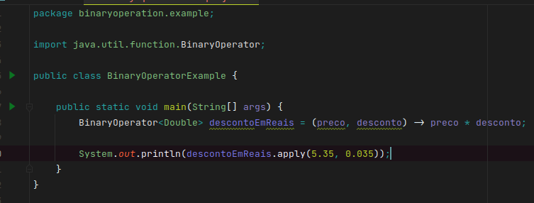
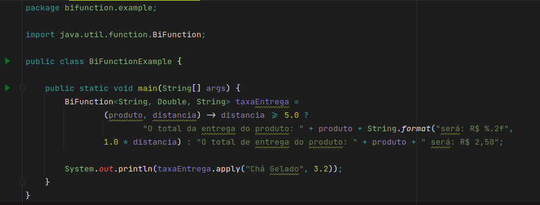

# Lambdas em Java


---

A programação funcional é um paradigma de programação baseado em um modelo 
de computação criado pelo matemático Alonzo Church, denominado `Cálculo Lambda`.
Nesse paradigma existem basicamente funcões puras, que podem utilizar a 
composição para criar funcões mais complexas.

As expressões lambdas foram inicialmente incluidas no Java 8 (2014).
Essas expressões são implementadas através de métodos abstratos únicos
(Single Abstract Method) com a annotation [@FunctionalInterface](https://docs.oracle.com/javase/8/docs/api/java/lang/FunctionalInterface.html) ou usando as interfaces `Function, 
Predicate, UnaryOperator` dentre outras. Essas interfaces estão disponíveis 
através do pacote [java.util.function](https://docs.oracle.com/javase/8/docs/api/java/util/function/package-summary.html)


---

## Function

As Functions recebem apenas um parâmetro, realizam a operação e geram o output.
O tipo de entrada não precisa ser o mesmo da saída.
É permitido fazer composição da Function com outras interfaces funcionais, 
usando `.andThen, .composition` e outros.

Estrutura

```java
...
Function<TipoEntrada, TipoSaida> nomeDaFunction = parametro -> operação;

```

Exemplo de implementação de uma Function:


Para realização operações com a Function basta utilizar o `.apply(parâmetro)
`.

---

## Predicate

Esse tipo de interface recebe como parâmetro apenas o tipo de entrada.
O retorno dessa interface é sempre booleano.
No caso do Predicate, ao invés de utilizar `.apply(parâmetro)`, é utilizado `.
test(parâmetro)`. É possível utilizar `or`, `and` e `negate` em conjunto com 
a operação. 

Estrutura:

```java
...
Predicate<Tipo da entrada> nomeDoPredicate = parâmetro -> operação;

```

Implementação:



---

## Consumer

Processa os dados consumidos e a saida é void. No Consumer a forma de passar 
o parâmetro é através do método `.accept(parâmetro)`. E, assim como as 
demais interfaces funcionais, também aceita composição.
Geralmente utilizado para processar dados de grandes coleções.

Estrutura:

```java
...
Consumer<Tipo que será processado> nomeConsumer = parâmetro -> operação;
```
Implementação:




---

## Supplier

Essa interface seria o contrário do que é um Consumer, ela ao invés de 
consumir os dados, ela irá gerar algo. É uma forma rápida de criar grandes 
coleções e recuperar/gerar dados. O valor gerado pode ser conferido através 
do método `.get()`.

Estrutura:

```java
Supplier<Tipo de saida> nomeSupplier = () -> operação;

```

Implementação:




---

## Unary Operator

Aceita um parâmetro de entrada, e seu tipo deve ser o mesmo da saida.

Estrutura:

```java
UnaryOperator<Tipo entrada e saida> nome = (parametro) -> operação;

```

Implementação:


---

## Binary Operator

Os tipos de entrada são os mesmos de saída.
Aceita dois parâmetros de entrada.

Estrutura:

BinaryOperator<Tipo entrada, tipo saida> nome = (primeiro_parametro, 
segundo_parametro) -> operação;

Implementação:



---

## BiFunction

Interface que aceita mais de um parâmetro (diferente da Function que aceita um), e inclusive, os tipos desses parâmetros podem ser diferentes.

Estrutura:

```java

BiFunction<Tipo da primeira entrada, tipo da segunda, tipo resultado> 
        nomeDaFunction = (primeiro_parametro, segundo) -> operação;

```

Implementação:



---

### Referências

- [Java Util Function Documentation](https://docs.oracle.com/javase/8/docs/api/java/util/function/package-summary.html)
- [Functional Programming in Java - FCC](https://www.youtube.com/watch?v=rPSL1alFIjI)
